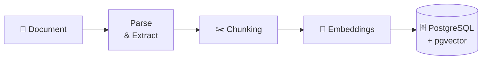

🧠 DocuMind

Ask questions about your documents — and see where the answers come from.

DocuMind is a full-stack document question-answering application built around Retrieval-Augmented Generation (RAG).

Upload documents, build a searchable knowledge base, ask questions in natural language, and receive answers grounded in retrieved document content.

<p align**=**"center">

  <a href**=**"https://youtu.be/ZbwSCWUdKiQ">

    

  </a>

</p>

<p align**=**"center">

  <b>▶ Click the preview above to watch the full demo</b>

</p>

🚧 Deployment in progress

DocuMind is currently being prepared for public deployment.

The application is not publicly hosted yet, but the complete workflow is demonstrated in the video above.

Want to see it in action?

Watch the full demo on YouTube

📌 What is DocuMind?

DocuMind is designed to turn a collection of documents into a searchable, conversational knowledge base.

Instead of sending an entire document to an LLM for every question, DocuMind uses a retrieval pipeline to find relevant pieces of information first and then provides that context to the language model.

The core idea is:

Documents

    ↓

Parse

    ↓

Chunk

    ↓

Generate embeddings

    ↓

Store in PostgreSQL + pgvector

    ↓

User asks a question

    ↓

Vector retrieval

    ↓

Reranking

    ↓

Relevant context

    ↓

LLM

    ↓

Answer + retrieved sources

🎯 The Problem

Important information is often buried inside long documents.

Imagine an employee has a 100-page company policy document and wants to know:

"How many paid leave days does a full-time employee receive each year?"

Manually searching the document is slow.

Sending the entire document to an LLM for every question is also inefficient and makes it harder to control what information the model uses.

DocuMind takes a retrieval-first approach:

User Question

     ↓

Find relevant document content

     ↓

Rank the retrieved candidates

     ↓

Give relevant context to the LLM

     ↓

Generate a grounded answer

This allows the application to work with a persistent document library rather than treating every question as an isolated prompt.

✨ Features

📚 Personal document library

Users can maintain a persistent library of documents that DocuMind can search and answer questions about.

💬 Natural-language document Q&A

Ask questions about your documents using a conversational interface rather than manually searching through files.

🎯 Scoped document retrieval

Users can query:

All documents in their library

A specific selected document

This allows retrieval to be constrained to the documents relevant to a conversation.

🔎 Document search

The library provides a search interface for finding documents within the knowledge base.

🧠 Retrieval-Augmented Generation

DocuMind retrieves relevant document chunks before sending context to the language model.

🔄 Reranking

Retrieved candidates can be passed through a reranking stage before the final context is constructed for generation.

📑 Retrieved source visibility

The chat interface exposes the sources used during retrieval, including the document, chunk identifier, and retrieval distance.

💾 Conversation history

Users can maintain multiple conversations and return to previous chats.

✏️ Conversation management

Conversations can be renamed or deleted from the chat interface.

🔐 Authentication

DocuMind provides account creation and sign-in so document libraries can be associated with individual users.

📸 Product Preview

🔐 Authentication

<p align**=**"center">

  

</p>

DocuMind provides a dedicated authentication flow for accessing a user's document library.

📚 Document Library

<p align**=**"center">

  

</p>

The library provides a central place to manage documents that are available to the retrieval system.

Documents expose their processing state, allowing the application to distinguish documents that are ready to be queried.

🎯 Select the documents you want to query

<p align**=**"center">

  

</p>

A conversation can search the entire library or be restricted to a specific document.

💬 Ask questions and inspect retrieved sources

<p align**=**"center">

  

</p>

The answer interface exposes the retrieved sources alongside the generated response.

This makes the retrieval stage visible instead of hiding the entire RAG process behind the final LLM answer.

🗂️ Conversation history

<p align**=**"center">

  

</p>

Users can maintain multiple conversations and manage them from the sidebar.

## 🏗️ Architecture

```mermaid

flowchart TB

    FRONTEND["🖥️ Frontend<br/>React + Vite<br/><br/>Authentication · Library · Chat · Document Selection"]

    BACKEND["⚡ Backend API<br/>FastAPI<br/><br/>Auth · Documents · Conversations · Query Orchestration"]

    POSTGRES[("🗄️ PostgreSQL")]

    DATA["Application Data<br/>Users · Documents<br/>Chunks · Conversations"]

    PGVECTOR[("🔎 pgvector<br/>Embeddings")]

    RETRIEVAL["🧠 Retrieval Pipeline<br/><br/>Query Embedding<br/>Vector Search<br/>Candidate Retrieval<br/>Reranking"]

    LLM["🤖 LLM<br/>Generation"]

    ANSWER["💬 Answer + Sources"]

    FRONTEND -->|"HTTP / REST"| BACKEND

    BACKEND --> POSTGRES

    POSTGRES --> DATA

    POSTGRES --> PGVECTOR

    BACKEND --> RETRIEVAL

    PGVECTOR --> RETRIEVAL

    RETRIEVAL -->|"Relevant Context"| LLM

    LLM --> ANSWER

    BACKEND --> ANSWER

---

```

🔍 RAG Pipeline

### Document Ingestion



## 🔍 How Query Processing Works

When a user asks a question, DocuMind does not immediately send the request to the LLM.

The application first retrieves the parts of the knowledge base that are relevant to the question, then uses those results to construct the context for generation.

```text
                         User Question
                               │
                               ▼
                    ┌─────────────────────┐
                    │ Query Representation│
                    │     / Embedding     │
                    └──────────┬──────────┘
                               │
                               ▼
                    ┌─────────────────────┐
                    │   Vector Search     │
                    │  Semantic Retrieval │
                    └──────────┬──────────┘
                               │
                               ▼
                    ┌─────────────────────┐
                    │ Candidate Chunks    │
                    └──────────┬──────────┘
                               │
                               ▼
                    ┌─────────────────────┐
                    │ Cross-Encoder       │
                    │     Reranking       │
                    └──────────┬──────────┘
                               │
                               ▼
                    ┌─────────────────────┐
                    │ Relevant Context    │
                    └──────────┬──────────┘
                               │
                    ┌──────────┴──────────┐
                    │                     │
                    ▼                     ▼
             User Question          Retrieved Context
                    │                     │
                    └──────────┬──────────┘
                               ▼
                    ┌─────────────────────┐
                    │        LLM          │
                    │   Answer Generation │
                    └──────────┬──────────┘
                               │
                               ▼
                    ┌─────────────────────┐
                    │ Answer + Sources    │
                    └─────────────────────┘
```

System design

The project explores an architecture where:

User-facing application

        ↓

Backend API

        ↓

Persistence + retrieval

        ↓

AI orchestration

        ↓

LLM generation

Each stage has a separate responsibility rather than putting the entire workflow inside a single LLM call.

🗃️ Data Flow

Document side

User

 │

 │ Upload

 ▼

FastAPI

 │

 ▼

Document processing

 │

 ├── Document metadata

 │

 └── Text chunks

          │

          ▼

      Embeddings

          │

          ▼

   PostgreSQL + pgvector

Question side

User

 │

 │ Question

 ▼

FastAPI

 │

 ▼

Query representation

 │

 ▼

Vector retrieval

 │

 ▼

Candidate chunks

 │

 ▼

Reranking

 │

 ▼

Relevant context

 │

 ▼

LLM

 │

 ▼

Answer + sources

📁 Project Structure

The repository is organized into separate frontend and backend applications.

DocuMind/

│

├── backend/

│   └── ...

│

├── frontend/

│   └── ...

│

└── README.md

The exact directory structure may evolve as the project continues to be developed.

🚀 Running Locally

DocuMind is currently being developed as a local full-stack application.

The application requires the frontend, backend, PostgreSQL/pgvector database, and local LLM environment to be configured.

High-level setup

1. Clone the repository

        ↓

2. Configure the backend environment

        ↓

3. Start PostgreSQL + pgvector

        ↓

4. Configure the local LLM

        ↓

5. Start the FastAPI backend

        ↓

6. Start the React/Vite frontend

        ↓

7. Open the application in your browser

Detailed environment variables and deployment instructions will be added as the project moves toward public deployment.


🗺️ Roadmap

The project is actively evolving.

Current

User authentication

Document library

Document upload

Document search interface

Conversational Q&A

Document-scoped querying

Conversation history

Vector-based retrieval

Reranking

Retrieved source visibility

Local LLM integration

Planned / evolving

Public deployment

Production infrastructure

More robust document ingestion

Improved observability and evaluation

Expanded document format support

Retrieval quality benchmarking

Additional production hardening

📌 Project Status

Active development

DocuMind is primarily a hands-on engineering project focused on understanding how a production-oriented document Q&A system can be designed and built from the ground up.

The project is being developed incrementally, with particular attention to:

Backend engineering

        +

AI / RAG engineering

        +

Database design

        +

System architecture

        +

User experience

🎯 What I wanted to learn from this project

DocuMind was built not only as a document chatbot, but as a way to understand the engineering decisions behind AI-powered applications.

The project brings together:

Backend APIs

Databases

Authentication

Document processing

Embeddings

Vector databases

Information retrieval

Reranking

LLMs

Frontend integration

System design

The goal is to understand how these components work together as a complete system rather than treating the LLM as a black box.

📄 License

License information will be added as the project is finalized.

<p align**=**"center">

  <b>DocuMind</b>

  <br>

  Document Q&A powered by retrieval and generation.

</p>