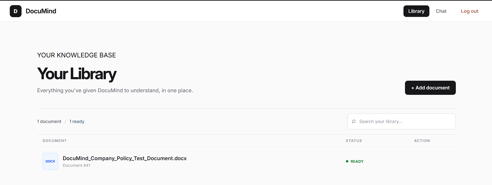
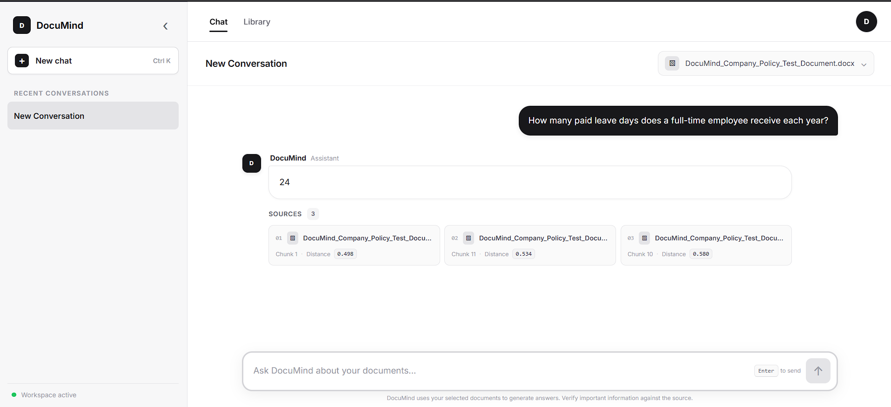
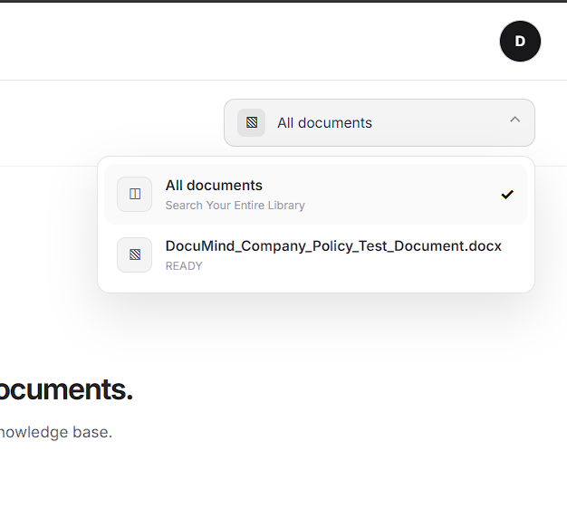
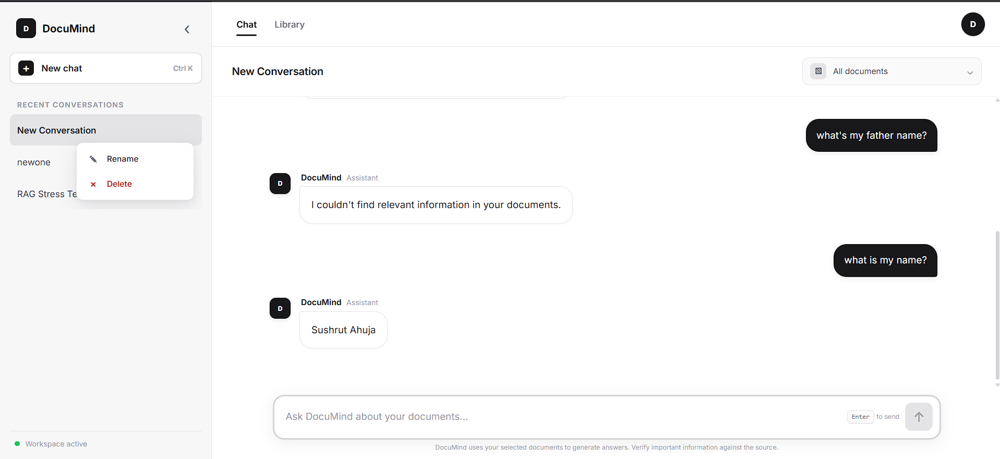
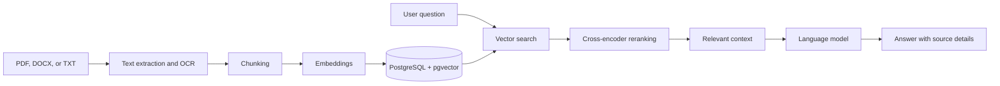

<div align="center">

<h1>DocuMind</h1>

<p><strong>Ask questions about your documents. Get answers grounded in their content.</strong></p>

<p>A full-stack document Q&amp;A app built with React, FastAPI, PostgreSQL, and retrieval-augmented generation.</p>

<a href="https://github.com/user-attachments/assets/12d1c34a-faf8-4c33-bbc0-47f81b470f29"></a>

<p><em>Animated preview. Click it to open the full demo video.</em></p>

</div>

---

## About

DocuMind turns a personal document library into a searchable, conversational knowledge base. Upload a document, ask a question in natural language, and get an answer supported by relevant passages from your files.

The retrieval pipeline extracts and chunks document text, creates vector embeddings, finds relevant chunks, reranks them, and sends the strongest matches to a language model. The chat response includes source details so you can inspect the retrieved material.

## Features

- **Document library:** Upload, search, and manage your documents.
- **Document Q&A:** Ask questions about a selected document.
- **Retrieval with sources:** Search document chunks by vector similarity, rerank candidates, and show the source document and chunk for each answer.
- **PDF, DOCX, and TXT ingestion:** Extract text from PDFs and Word documents; use OCR for scanned or image-based PDF pages.
- **Accounts and conversations:** Sign up, sign in, and keep conversation history.
- **Local language model support:** Generate answers through an OpenAI-compatible LM Studio server.

## Screenshots

### Document library



### Ask questions and inspect sources



### Choose which document to query



### Conversation history



## How it works


```mermaid
flowchart LR
    A[PDF, DOCX, or TXT] --> B[Text extraction and OCR]
    B --> C[Chunking]
    C --> D[Embeddings]
    D --> E[(PostgreSQL + pgvector)]
    F[User question] --> G[Vector search]
    E --> G
    G --> H[Cross-encoder reranking]
    H --> I[Relevant context]
    I --> J[Language model]
    J --> K[Answer with source details]
```

## Technology

| Area | Tools |
| --- | --- |
| Frontend | React, Vite, JavaScript |
| API | FastAPI, Python |
| Database | PostgreSQL, SQLAlchemy, pgvector, Alembic |
| Embeddings | Sentence Transformers (`all-MiniLM-L6-v2`) |
| Reranking | Sentence Transformers (`cross-encoder/ms-marco-MiniLM-L-6-v2`) |
| Answer generation | LM Studio with an OpenAI-compatible API |
| Document processing | PyMuPDF, Tesseract OCR, python-docx |

## Run locally

### Prerequisites

- Python and Node.js with npm
- PostgreSQL with the **pgvector** extension installed
- [LM Studio](https://lmstudio.ai/) with the `qwen_qwen3-0.6b` model available and its local server enabled
- Tesseract OCR with English and Hindi language data (`eng` and `hin`) for scanned PDF processing

The first backend startup may take longer while Sentence Transformers downloads its embedding and reranking models.

### 1. Clone the repository

```bash
git clone <repository-url>
cd Documind
```

### 2. Create the database and enable pgvector

Create a PostgreSQL database, then enable the extension in that database:

```sql
CREATE EXTENSION IF NOT EXISTS vector;
```

### 3. Configure the backend

Create a `.env` file in the repository root:

```env
DATABASE_URL=postgresql://<user>:<password>@localhost:5432/<database>
JWT_SECRET_KEY=<a-long-random-secret>
```

Create a virtual environment and install the Python dependencies:

```bash
python -m venv .venv
```

Activate it, then run:

```bash
# Windows PowerShell
.venv\Scripts\Activate.ps1

# macOS / Linux
source .venv/bin/activate

pip install -r requirements.txt
```

Apply the database migrations and start the API:

```bash
alembic upgrade head
uvicorn app.main:app --reload
```

The API runs at `http://localhost:8000`. Interactive API documentation is available at `http://localhost:8000/docs`.

### 4. Start the frontend

In a second terminal:

```bash
cd frontend
npm install
npm run dev
```

Open the local URL printed by Vite (typically `http://localhost:5173`). The frontend expects the API at `http://localhost:8000`.

### 5. Start the local model server

In LM Studio, load `qwen_qwen3-0.6b` and start the local server on `http://localhost:1234`. The backend currently uses this LM Studio endpoint and model name directly in `app/services/llm_service.py`.

Create an account, upload a PDF, DOCX, or TXT file, and start a conversation about its contents.

## Project layout

```text
Documind/
|-- app/                 # FastAPI API, database models, and RAG services
|-- alembic/             # Database migrations
|-- assets/              # Screenshots and project demo video
|-- frontend/            # React + Vite application
|-- storage/             # Uploaded documents (created locally)
|-- requirements.txt
`-- README.md
```

## Current scope

DocuMind is an active development project. It is designed for local development and currently uses local service addresses and a locally hosted model; public deployment configuration is not included.

## License

No license has been specified yet.
